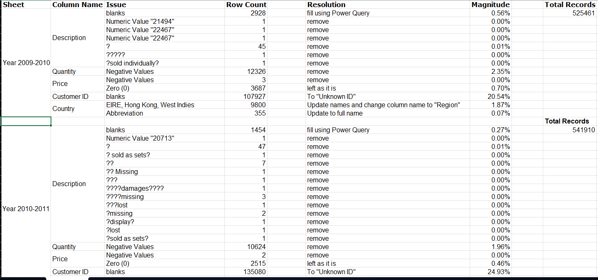
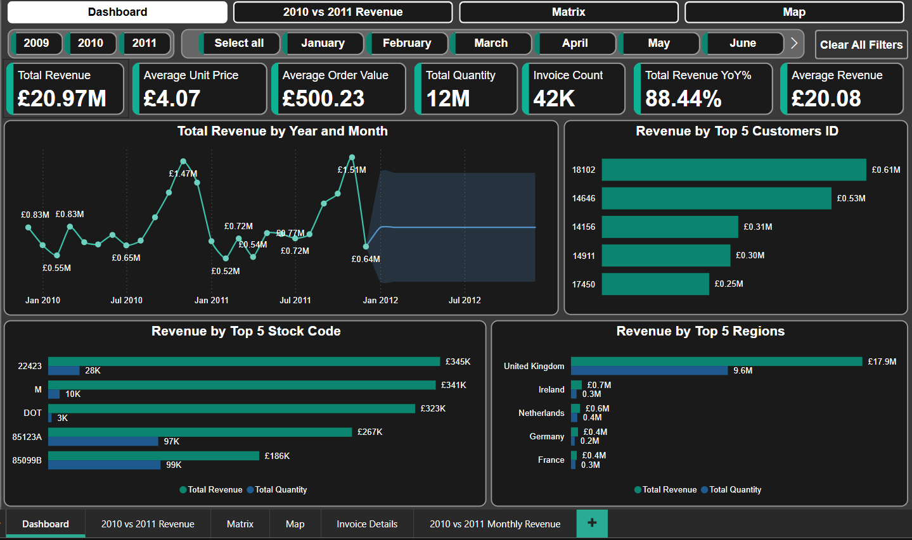
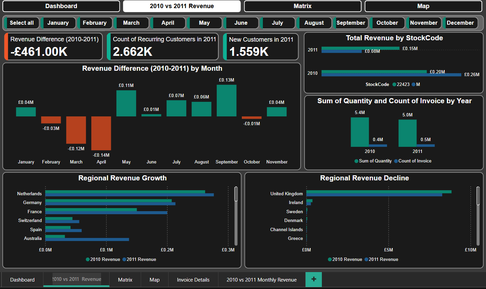
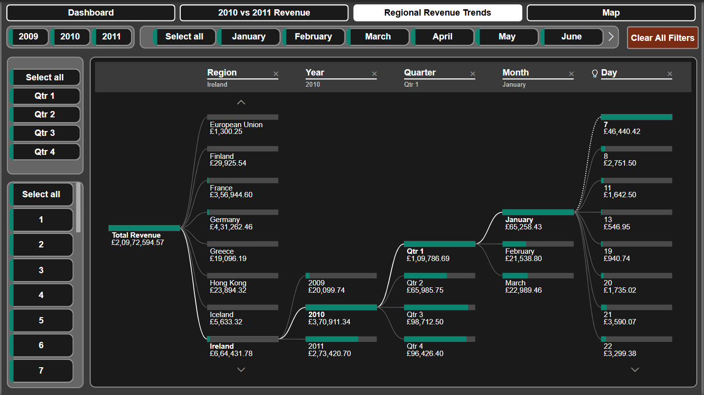
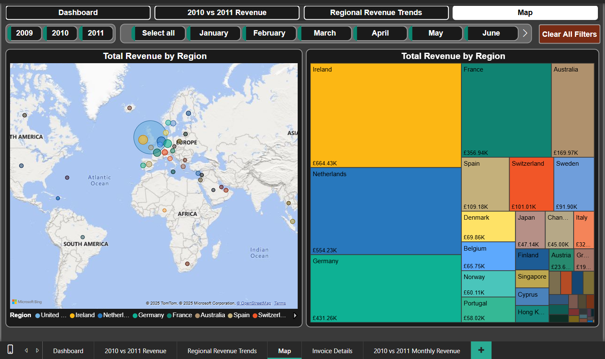

# Online Retail II Sales Analysis Dashboard

## Introduction

This project delivers a Power BI dashboard built on the “Online Retail II” dataset (UCI ML Repo). It provides actionable insights into sales trends, customer behaviour, and product performance for a UK-based online retailer over 2009–2011.

## Problem Statement

The goal is to transform raw transaction logs into a clean, interactive reporting tool that enables:
- Year-over-Year performance tracking  
- Regional and product hierarchy analysis  
- Identification of top customers and SKUs  
- Detailed drill-through to transaction lines  
- Data-driven decisions on promotions, inventory, and customer retention

## Dataset

- Source: UCI Machine Learning Repository (Online Retail II)  
- Span: Dec 1, 2009 – Dec 9, 2011  
- Records: 1,067,371 invoice lines  
- Key fields: InvoiceNo, StockCode, Description, Quantity, InvoiceDate, UnitPrice, CustomerID, Country

## Data Cleaning & Preparation

- Filled blank descriptions using Power Query
- Merged two sheets (2009–2010, 2010–2011) into a single Transactions table  
- Filtered returns (negative Quantity and negative Price) and cancellations (InvoiceNo starts with “C”) 
- Handled missing CustomerIDs and blank Descriptions (flagged or removed)  
- Standardized Country/Region names  

## Data Model

- Star schema: Year_2009_2011 fact table joined to a Calendar_Table dimension
- Marked Calendar_Table for time intelligence (YoY, rolling windows)
- Relationship: Calendar_Table[Date] → Year_2009_2011[InvoiceDate]

## Dashboard Overview

An interactive Power BI report spanning 2009–mid-2012, organized into four pages for layered insights and effortless exploration.

### **Page 1 – Executive Summary**

A bird’s-eye view of performance with:
- High-level KPI cards (Revenue, Quantity, Invoices, AOV, AUP)  
- Monthly revenue trend with year-over-year comparison and moving average  
- Top 5 customers and Top 5 SKUs bar charts with Pareto overlays  

### **Page 2 – Year-over-Year Analysis**

Focused on comparative dynamics:
- Total and monthly revenue deltas (2011 vs 2010)  
- Recurring vs new customer growth  
- Quantity vs invoice count shifts  
- SKU-level revenue mix evolution  

### **Page 3 – Regional Drill-Down**

Enables cascading filters and flowchart breakdown:
- Slicers for Year, Quarter, Month, Day and clear-all button  
- Stepwise decomposition of total revenue by region → time → day  

### **Page 4 – Geographic Distribution**

Visualizes revenue across locations:
- Interactive choropleth map and sized-dot layer  
- Treemap summarizing regional revenue shares  
- Combined map/table filters for dynamic exploration

## Key Features

- High-level KPI cards summarizing Total Revenue, Quantity Sold, Invoice Count, Average Order Value, Average Unit Price and YoY Revenue Growth   
- Year-over-Year delta calculations for total and monthly revenue, alongside recurring vs new customer growth
- A revenue‐delta KPI card comparing total 2011 vs 2010 performance
- Monthly variance chart outlining revenue gains and losses by month (Jan–Nov)
- Customer segmentation cards showing recurring vs new customers in 2011
- SKU-level revenue mix comparison to highlight shifts in product performance  
- Cascading slicers (Year, Quarter, Month, Day) with a clear-all button for precise drill-down  
- Flowchart-style revenue decomposition from region through year, quarter, month to day granularity  
- Interactive choropleth map and proportional-dot layer showing geographic revenue distribution  
- Treemap view for at-a-glance regional revenue shares  
- Combined map and table filters for seamless region-centric analysis

## Tools & Technologies

- Power BI Desktop (Data prep: Power Query; visuals & measures: DAX)
- Microsoft Excel 2021 (create a log of issues in the dataset; Power Query to fill blank descriptions)

## File Structure

```
├── data/
│   ├── online_retail_II.xlsx
│   ├── Filled_Blank_Desc.xlsx
│   └── Issues_Log.xlsx
├── images/
│   ├── dashboard/
│   │   ├── Dashboard.png
│   │   ├── 2010 vs 2011 Revenue.png
│   │   └── Regional Revenue Trends.png
│   └── issues/
│       └── Issues Log.png
├── pbix/
│   └── Online_Retail.pbix
└── README.md
```

## How to Use

1. Clone the repo and open the `.pbix` file in Power BI Desktop.  
2. Point the source in Power Query to `data/Filled_Blank_Desc.xlsx`.  
3. Refresh to load and transform.  
4. Explore the dashboard pages, slicers, and drill-through details.

## Issues


## Dashboard

- Page 1 – Executive Summary



- Page 2 – 2010 vs 2011 Analysis



- Page 3 - Regional Drill-Down



- Page 4 - Geographic Distribution


