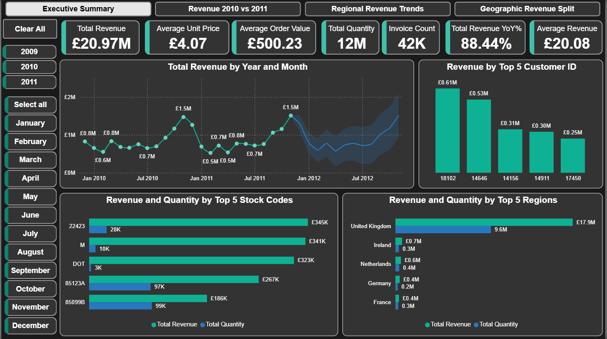

# Online Retail 2009-2011

## Introduction

This project presents an interactive **Power BI dashboard** built on the **“Online Retail II” dataset** from the [UCI Machine Learning Repository](https://archive.ics.uci.edu/ml/datasets/Online+Retail+II). It analyzes **1,067,371 transactions** from a **UK‑based online retailer** between **Dec 2009 and Dec 2011**.  

Combining data quality checks with multi‑page visual reports, it delivers insights into **sales trends**, **product performance**, and **regional revenue patterns**, enabling informed, data‑driven decisions.


## Problem Statement

The goal is to transform raw transaction logs into a clean, interactive reporting tool that enables:
- Year-over-Year performance tracking  
- Regional and product hierarchy analysis  
- Identification of top customers and SKUs  
- Detailed drill-through to transaction lines  
- Data-driven decisions on inventory, and customer retention


## Dataset

- Source: **“Online Retail II” dataset** from the [UCI Machine Learning Repository](https://archive.ics.uci.edu/ml/datasets/Online+Retail+II)
- Span: Dec 1, 2009 – Dec 9, 2011  
- Records: 1,067,371 invoice lines  
- Key fields: InvoiceNo, StockCode, Description, Quantity, InvoiceDate, UnitPrice, CustomerID, Country


## Data Cleaning & Preparation

- Filled blank descriptions using Power Query
- Merged two sheets (2009–2010, 2010–2011) into a single Transactions table  
- Filtered returns (negative Quantity and negative Price) and cancellations (InvoiceNo starts with “C”) 
- Handled missing CustomerIDs and blank Descriptions (flagged or removed)  
- Standardized Country/Region names 


## Data Model

- Star schema: Year_2009_2011 fact table joined to a Date dimension table
- Marked Dim_Date for time intelligence (YoY, rolling windows)
- Relationship: Dim_Date[Date] → Year_2009_2011[InvoiceDate]


## Dashboard Overview

An interactive Power BI report covering the period from December 2009 to December 2011, organized across four pages to deliver layered insights and seamless exploration.


### **Page 1 – Executive Summary**



This page provides a comprehensive view of business performance through a series of high‑impact visual insights:  
- High‑level KPI cards showcase **Total Revenue, Total Quantity, Invoice Count, Average Order Value (AOV)**, and **Average Unit Price (AUP)** for a quick performance snapshot.  
- A **Total Revenue by Year and Month** trend chart outlines historical patterns, supported by revenue forecasts for the next 12 months to aid strategic planning.  
- **Top 5 Customers** and **Top 5 SKUs** are highlighted in bar charts, revealing the most valuable relationships and product lines.  
- **Regional revenue distribution** offers a clear breakdown of contributions by key markets, pinpointing areas of strength and growth opportunity.  


### **Page 2 – Revenue 2010 vs 2011**


This page delivers a clear comparative view of business shifts between 2010 and 2011, spotlighting performance drivers and market dynamics.
- **Revenue change analysis** captures both the **overall year‑on‑year delta** and **month‑by‑month variations**, revealing periods of **growth** and **decline** across the calendar year.  
- **Customer segmentation insights** contrast **recurring** and **new customer counts**, highlighting **acquisition trends** and **retention performance** in **2011**.  
- **Volume versus invoicing patterns** compare **total quantities sold** with **invoice volumes**, offering a lens on **transaction size** and **sales frequency** changes.  
- **SKU‑level revenue composition** examines shifts in the mix between **key product codes**, providing visibility into **evolving product demand** and **contribution**.   


### **Page 3 – Regional Revenue Trends**


This page empowers layered, drill‑down analysis through intuitive, cascading filters and a clear flow of information.
- **Dynamic slicers** for **Year**, **Quarter**, **Month**, and **Day**, along with a convenient **clear‑all control**, allow for flexible, targeted data exploration.
- **Stepwise revenue decomposition** flows from **total revenue** into **regional performance**, then narrows further by **time period** down to the **daily level**, enabling precise identification of trends and anomalies.


### **Page 4 – Map**


**This page visualizes geographic revenue distribution using complementary mapping techniques.**  
- **Bubble Map** displays each location’s revenue as **proportionally sized bubbles**, providing immediate visual cues to relative market scale across regions.  
- **Tree Map** summarizes **regional revenue shares** in a hierarchical layout, enabling quick comparison of contributions from individual countries and markets.  


## Key Features

- High-level KPI cards summarizing Total Revenue, Quantity Sold, Invoice Count, Average Order Value, Average Unit Price and YoY Revenue Growth   
- Year-over-Year delta calculations for total and monthly revenue, alongside recurring vs new customer growth
- A revenue‐delta KPI card comparing total 2011 vs 2010 performance
- Monthly variance chart outlining revenue gains and losses by month
- Customer segmentation cards showing recurring vs new customers in 2011
- SKU-level revenue mix comparison to highlight shifts in product performance  
- Cascading slicers (Year, Quarter, Month, Day) with a clear-all button for precise drill-down  
- Flowchart-style revenue decomposition from region through year, quarter, month to day granularity  
- Bubble Map displaying each location’s revenue as proportional-sized bubbles
- Treemap view for at-a-glance regional revenue shares  

## Tools & Technologies

- Power BI Desktop (Data preparation: Power Query, visuals & measures: DAX)
- Microsoft Excel 2021: create an issue log to track dataset anomalies, and use Power Query to auto-fill blank descriptions.

## File Structure

```
├── data/
│   ├── online_retail_II.xlsx
│   ├── Filled_Blank_Desc.xlsx
│   └── Issues_Log.xlsx
├── images/
│   ├── dashboard/
│   │   ├── executive_summary.png
│   │   ├── revenue_2010_vs_2011.png
│   │   └── regional_revenue_trends.png
│   │   └── map.png
│   └── issues/
│       └── Issues_Log.png
├── pbix/
│   └── Online_Retail.pbix
└── README.md
```

## Getting Started

1. Clone the repo and open the `.pbix` file in Power BI Desktop.  
2. Point the source in Power Query to `data/Filled_Blank_Desc.xlsx`.  
3. Refresh to load and transform.  
4. Explore the dashboard pages, slicers, and drill-through details.